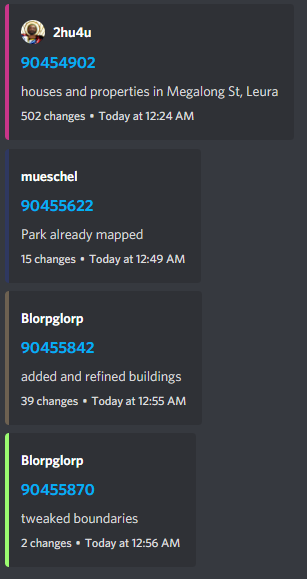

# OSM Feed - Discord

I tried to find a resource that would notify of Open Street Maps changes in a specific region and was not able to find one that could encompass the entirety of Australia.
This project tracks the changes made and sends messages to a Discord channel when they are made in a specific region.

# How it Works

1. Every minute, it downloads the latest changes from https://planet.openstreetmap.org/replication/minute/.
2. Parses all changes
3. Finds changes within Australia/bounds
4. Sends a message to a Discord webhook for each change

If it ever goes down and is restarted, it will resume at the last set of changes it checked and run until it reaches the present, upon which it will run every minute as per usual.

# How to set up and customise

To run:

1. Run `npm install`
2. Duplicate `settings.template.json` and rename to `settings.json`
3. Add Discord webhook url to `settings.json` as `webhookUrl`
4. [Optional] Customise `bounds` to notify of changes for in `settings.json`
4. Run `node main.js`

# Example Discord Messages

